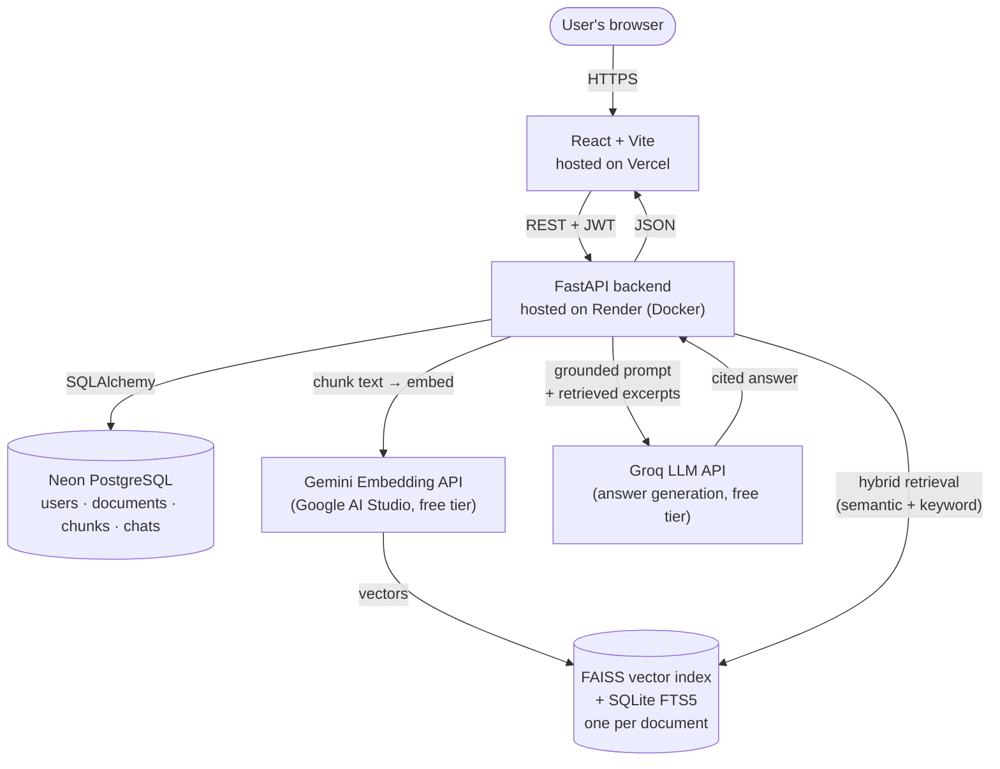

<div align="center">


### AI Document Intelligence & Research Assistant

Upload a document, ask it questions in plain English, and get answers grounded in the actual text — with citations pointing to the exact page, never invented.

[](https://talkify-v2-0.vercel.app)
[](https://talkify-v2-0-backend.onrender.com/api/health)
[](https://www.python.org/)
[](https://fastapi.tiangolo.com/)
[](https://react.dev/)
[](https://neon.tech/)
[](LICENSE)

**[Try it live →](https://talkify-v2-0.vercel.app)**

</div>

---

## What this is

Talkify is a full-stack RAG (Retrieval-Augmented Generation) platform, built from scratch rather than assembled from a single LangChain call: hand-written document chunking, hybrid semantic + keyword search, citation-grounded generation, and per-user authentication and data isolation, all deployed for free without a credit card anywhere in the stack.

It's the rebuild of an earlier Streamlit prototype (see [`docs/ARCHITECTURE.md`](docs/ARCHITECTURE.md) for what changed and why) into something closer to a real product: persistent storage, real auth, multi-format ingestion, and a UI you'd actually want to use twice.

**Try it now:** register a free account at [talkify-v2-0.vercel.app](https://talkify-v2-0.vercel.app), upload a PDF or `.txt` file, and ask it a question.

## Why this stands out

Most student RAG projects get built once and never see a real user or a real deployment constraint. This one did, and every constraint it hit forced a real engineering decision rather than a workaround:

- **A version-pinning bug silently dropped auth routes in production** — the server started fine and logged normally, but `/api/auth/login` returned a genuine 404. Root-caused to an unpinned FastAPI install pulling a materially different router implementation. Fixed with exact pins plus a self-check script (`scripts/verify_setup.py`) that catches this exact failure mode by name if it ever recurs.
- **Documents got stuck on "processing" forever, silently.** Root cause: Neon's pooled Postgres connection can go stale during the real gap between marking a document "processing" and finishing embedding — and the resulting exception wasn't caught anywhere, so nothing ever marked it failed. Fixed with connection health-checks (`pool_pre_ping`) and a background-task safety net that guarantees a document always ends up in a terminal state with a real error message, never an infinite spinner.
- **PyTorch doesn't fit in a free host's memory budget, at any model size.** Local embeddings via `sentence-transformers` need 200MB–1GB+ of RAM just for PyTorch to run — every card-free hosting tier in 2026 caps around 512MB. After tuning thread counts, batch sizes, and memory-trimming still wasn't enough, the actual fix was architectural: move embedding generation to a hosted API entirely. **Measured result: backend memory dropped from an OOM-crashing 512MB+ to ~147MB RSS**, verified via `/proc/<pid>/status`, not estimated.

Full write-up of each, with the actual reasoning, in [`docs/INTERVIEW_PREPARATION.md`](docs/INTERVIEW_PREPARATION.md).

## Architecture



**Request flow for a question:** the frontend sends a question scoped to one or more documents → the backend runs semantic search (FAISS) and keyword search (SQLite FTS5) in parallel → merges and ranks the results (`hybrid_search.py`) → builds a prompt that separates system instructions, untrusted document content, and the user's question (prompt-injection defense) → Groq generates an answer citing the numbered excerpts → the response is persisted and returned with structured citation data the frontend renders as clickable source chips.

Every stage — chunking, hybrid retrieval, prompt construction, citation mapping — is a separate, readable Python module in `backend/app/rag/`, not hidden behind a single framework call. See [`docs/ML_EXPLANATION.md`](docs/ML_EXPLANATION.md) for the concepts and [`docs/ARCHITECTURE.md`](docs/ARCHITECTURE.md) for the full module map.

## Live deployment

| Service | Provider | Notes |
|---|---|---|
| Frontend | [Vercel](https://vercel.com) | Free tier, deploys from `frontend/` on push |
| Backend | [Render](https://render.com) | Free tier (512MB RAM), Docker, deploys from `backend/` |
| Database | [Neon](https://neon.tech) | Free serverless Postgres |
| Embeddings | Google Gemini API | Free tier, `gemini-embedding-001` |
| LLM generation | Groq API | Free tier, `openai/gpt-oss-20b` |

Zero-cost end to end, no credit card on file anywhere. Full deployment walkthrough (and the exact failure modes to check for if something breaks) in [`docs/SETUP.md`](docs/SETUP.md).

> **One honest caveat:** Render's free tier has no persistent disk. Uploaded files and their search indexes don't survive a redeploy or a long idle-triggered restart — document records persist in Postgres, but you'd need to re-upload after either event. Fine for a live demo, on the list to fix properly (see Roadmap).

## Feature status

<details>
<summary><b>Click to expand the full, honest checklist</b> — nothing below is overstated, and nothing is faked with a dead button.</summary>

| Area | Status |
|---|---|
| Auth (register/login/JWT), per-user data isolation | ✅ Done, tested |
| Document upload + validation (type/size) | ✅ Done, tested |
| Hand-built ingestion pipeline (loaders → chunking → embeddings → FAISS → FTS5) | ✅ Done |
| Background processing (non-blocking upload, live status polling) | ✅ Done |
| Hybrid retrieval (semantic + keyword, weighted merge) | ✅ Done, unit tested |
| Citation-grounded chat, with a free extractive fallback | ✅ Done |
| Multi-document chat | ✅ Done |
| Chat history | ✅ Done |
| Dashboard with real (non-fabricated) analytics | ✅ Done |
| Responsive UI (mobile drawer nav, adaptive layouts) | ✅ Done |
| Live production deployment (Vercel + Render + Neon) | ✅ Done |
| Retrieval evaluation harness | ✅ Built; dataset starts **empty** — fill it with your own questions |
| Document Summary page | ❌ Not built — no backend endpoint yet |
| Document Comparison page | ❌ Not built |
| Study Assistant (flashcards/MCQs) | ❌ Not built |
| Document Viewer (PDF page navigation, in-page highlighting) | ❌ Not built — documents can be uploaded/deleted/chatted with, but not previewed inline |
| OCR for scanned PDFs | ❌ Not built (fails clearly instead of silently returning nothing) |
| Persistent file/index storage across redeploys | ❌ Not built yet — see the caveat above |
| Frontend automated tests | ❌ Not built (backend has 40+ automated tests) |

</details>

## Tech stack

**Backend:** Python, FastAPI, SQLAlchemy, Pydantic, PyMuPDF, python-docx, pandas, FAISS, SQLite FTS5, Gemini Embedding API, Groq LLM API
**Frontend:** React, Vite, Tailwind CSS, React Router, react-markdown
**Database:** PostgreSQL (Neon) in production, SQLite for zero-setup local dev
**Deployment:** Docker, Render, Vercel

## Quick start

**Backend:**
```bash
cd backend
python -m venv venv && source venv/bin/activate   # Windows: venv\Scripts\activate
pip install -r requirements.txt
cp .env.example .env   # set SECRET_KEY and GEMINI_API_KEY at minimum
uvicorn app.main:app --reload
```
API docs at `http://localhost:8000/docs`.

**Frontend:**
```bash
cd frontend
npm install
cp .env.example .env
npm run dev
```
App at `http://localhost:5173`.

**Or with Docker:**
```bash
docker compose up --build
```
Runs Postgres, backend, and frontend together. Set `SECRET_KEY`, `GEMINI_API_KEY`, and (optionally) `GROQ_API_KEY` as environment variables first.

Embeddings require a free [Gemini API key](https://aistudio.google.com/apikey) (no card) — there's no offline fallback for that specific step. LLM generation works without a key too, in a clean extractive fallback mode (real retrieved excerpts, no generated prose) if `GROQ_API_KEY` is left blank.

## Testing

```bash
cd backend
pytest -v
```
40+ tests covering chunking, hybrid-search score merging, citation mapping, prompt-injection defense, document loaders, embedding batching/retry logic, and full API flows (auth, upload validation, cross-user isolation, background-processing failure handling). One test needs live internet access to the Gemini API and is skipped (not failed) without it.

## Documentation

- [`docs/SETUP.md`](docs/SETUP.md) — local + Docker + free production deployment, with troubleshooting for every real issue hit along the way
- [`docs/ARCHITECTURE.md`](docs/ARCHITECTURE.md) — full system design, module map, and the production debugging story
- [`docs/ML_EXPLANATION.md`](docs/ML_EXPLANATION.md) — embeddings, hybrid search, RAG, and evaluation explained simply, mapped to real code
- [`docs/API_DOCUMENTATION.md`](docs/API_DOCUMENTATION.md) — every endpoint, with examples
- [`docs/INTERVIEW_PREPARATION.md`](docs/INTERVIEW_PREPARATION.md) — Q&A matched to what's actually implemented, including the three production bugs above
- [`backend/evaluation/README.md`](backend/evaluation/README.md) — how to build a real retrieval evaluation dataset

## Known limitations

- No OCR: scanned PDFs with no text layer fail with a clear error rather than silently returning nothing.
- DOCX has no real page concept (`python-docx` doesn't expose pagination), so DOCX citations always say "page 1" — documented, not hidden.
- Embeddings need internet access and a Gemini API key; there's no local fallback for that specific step.
- Uploaded files and search indexes live on ephemeral disk in production — see the deployment caveat above.
- Hybrid search weights (0.7 semantic / 0.3 keyword) are a reasonable starting point, not something tuned against real measured data yet — `backend/evaluation/` is where that tuning would happen.

## Roadmap

1. Move uploaded files and FAISS/FTS5 indexes into durable storage (Postgres-backed or object storage) so they survive a redeploy.
2. Build out a real evaluation dataset with measured recall@k/MRR checked into the repo.
3. Document Viewer with inline page navigation and citation-click highlighting.
4. Summary and Study Assistant features, reusing the existing retrieval pipeline with different prompts.

## License

MIT — see [`LICENSE`](LICENSE).
